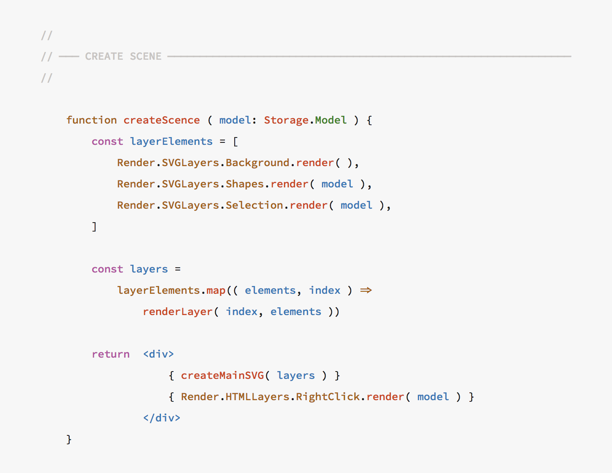

# Overview of Kary Coding Standards

## Philosophy

Code is something very pretty. It's a form af art and engineering. Yet, we write codes that look messy and horrible. I believe that codes must look nice and beautiful. When you read them they must show how carefully they were written and how much love was put into writing them. Code must look like candy and art. This standard is one—in a [series of attempts](https://writings.kary.us/2017/05/16/my-journey-to-clean-code/)—to push the state of beauty and functionality in code. 

## Core Beliefs

1. Programmers are no robots, they have hearts and they deserve beauty
2. Code is a  form of art and literature and thus it deserves to be written beautifully
3. Code is a _Piece of Writing_ and therefore must have layout and design principles involved in it
4. Writing something with care results in higher quality

Kary Coding Standards is an umbrella body of works that contains many standards, designs, beliefs, libraries, languages, and tools to achieve a harmonious state-of-the-art coding standard that respects the four mentioned believes.

## Structure of This Document

This document is the documentation and specification of Kary Coding Standards. 

### Language Standards

These are the specifications of the coding standard for some general languages—starting with web languages for their mass use.





### Software Tools

The Kary Coding Standards are no easy standards to implement. They put functionality and beauty first and therefore typing efficiency is not a priority. That is because, the standards have their own set of companying software that facilitate the heavy formatting and generation of complex statements \(such as Kary Comments\). The documentation for these tools are also included within this document to make it a coherent and self-contained standard.





### Kary Comments

Kary Comments are the foundations of this standard and while most languages contain their own rules and specificities, these are shared widely across any language that implements Kary Coding Standard. For better understanding of these comments, there is a series of short articles explaining them







