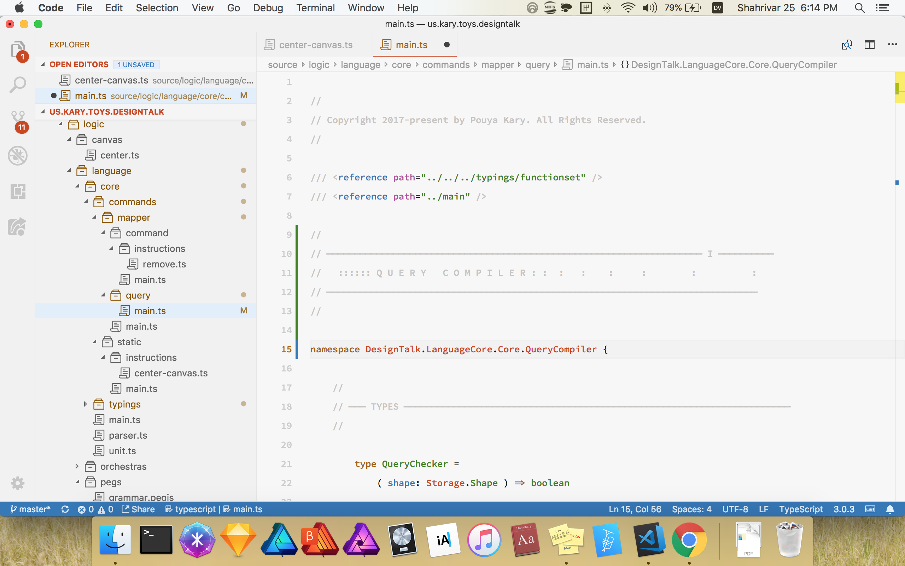

# Decorational Comments

## Flag Comments

A flag is a big comment, it is more decorating than other comments and takes 5 lines of space. So if we think of section comment has Heading 2, then a flag comment is probably Heading 1.


A good thing about flags is that they are immensely big and therefore easy to spot in the mini maps.



Flags are are not first-class fundamentals because they are designed for very big files \(say more than 750~1000 lines of code\) and Kary Coding Standards does not encourage the use of big files. It is rather recommended to use many files and keep them small so that the organization of your codes remain well.


## InSection Comments

