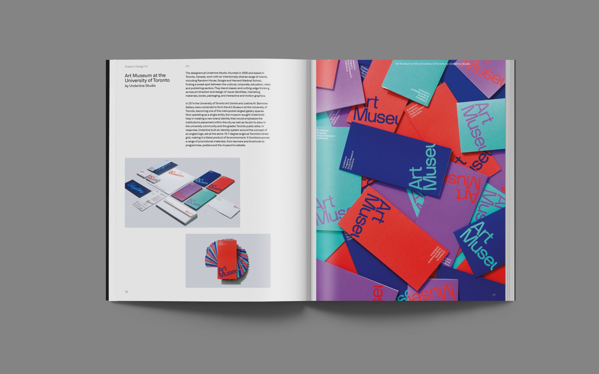
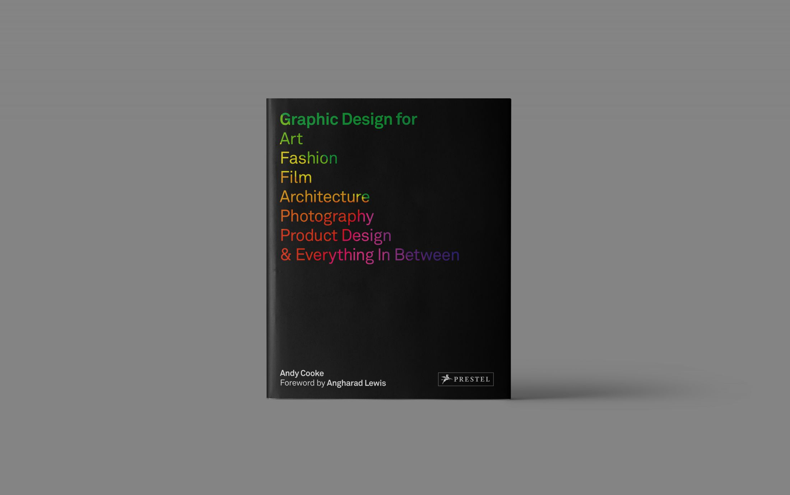
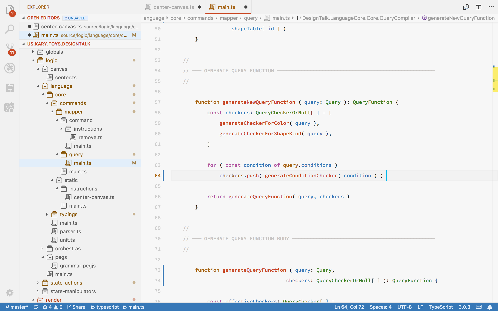

# Introduction to Kary Comments

## Fundamentals

Code is a piece of writing; mostly in a textual language and therefore like any other writing it is important to introduce the fundamentals of layouts into code for better management, beauty and ergonomics.

### Negative Space

Have you ever noticed how much a good book has empty white spaces? That is called a **negative space**. It is proven that mind cannot process too much and when provided with a many figures, or a hard sentences it becomes really hard for the mind to understand the context.

Designers—when given contents that require focus—surround those content with enough negative space that it becomes easy to concentrate and breath. If you look you see that even this very document is full of negative spaces.

Code is a heavily complex subject. Sometimes; even harder than math since the reader has to have thousands of lines of code in their mind to be able to read a new part of a complex system. Yet, coders do not use white space enough. Most coders love the idea of small fonts, longer lines and less spaces for a tab. What we know as the spaghetti code is the ultimate nightmare of this flow.

Kary Comments introduce enough indentation and empty lines that when dealing with a code, the users focus on the context that is relevant to them. They get the chance to breath every once in a while and that is a big help.

### Eye Flow

Eye flow is the art of directing the reader's eye to see objects in order. By manipulating the size, color, position and weight of an object you make it pop out more and therefore be seen faster.

In code, unfortunately we use monospaced fonts and this enforces the same weight across the whole syntax which makes it having eye flow harder. Kary Comments establishes weights in form of ASCII art and therefore makes it possible to have hierarchy, focus point and right eye flow within code. 

### Layout

Have you ever tried to jump in novel? The hard part is that you have to start reading till realizing you were two page ahead. That is because novels come without any layout. The task of a layout system is to establish a foundation for jumping. You can always jump in a magazine from an article to another because they always have such great layouts. 

I have realized that syntax highlighting also tries to establish the same goal, even if not realized by anyone in the industry. If you look at a code without highlights you see that you have to read it from start to end in order to realize it. While with highlights you can continuously jump around from one function to the other and instantly zoom in where you wanted to be. 

While code highlighting is awesome, it can only do so much. Have you ever got lost wondering what is closed by that `}` ?. Kary Comments help you draw visible and thick lines between the parts of your code and have them managed and organized. It's like comparing the layout of a text book to the layout of a great photography book. While the first one is great, the other is much more effective and easy to navigate.

## The Ideals In Action

Kary Comments are ways to separate parts of your code; create desirable negative space and establish eye flow but also decorate and beautify your codes. Kary Comments are the essential foundations of the Kary Coding Standard.

## How To Write These Comments?

Writing these comments are really hard by hand and therefore a series of software are made to make it possible. They come in many forms and can be used in any platform. For Visual Studio Code you have V, for OS X the 3 and remember that IV works on the browser so you have it on all platforms and editors.


The pictures within this document are shot by the Creative Boom magazine. [The full article can be found here](https://www.creativeboom.com/resources/new-book-reveals-groundbreaking-campaigns-from-some-of-the-worlds-leading-studios/)


