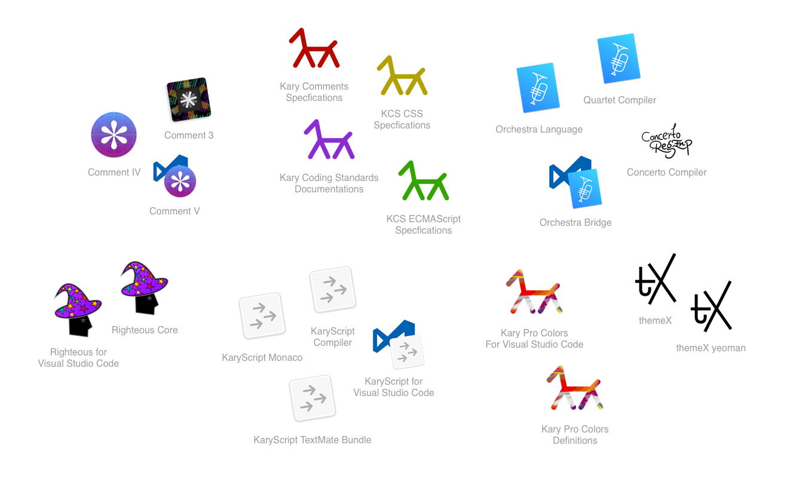
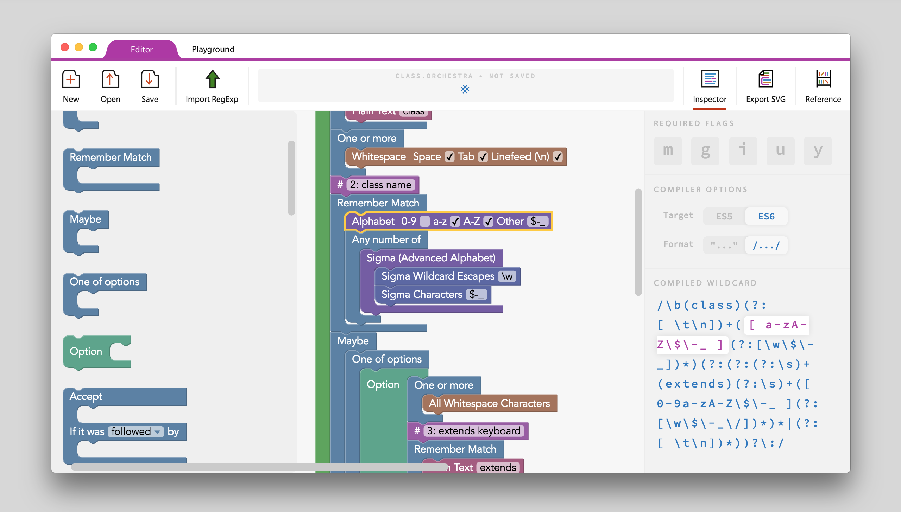
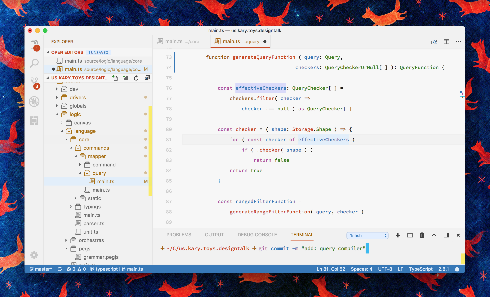
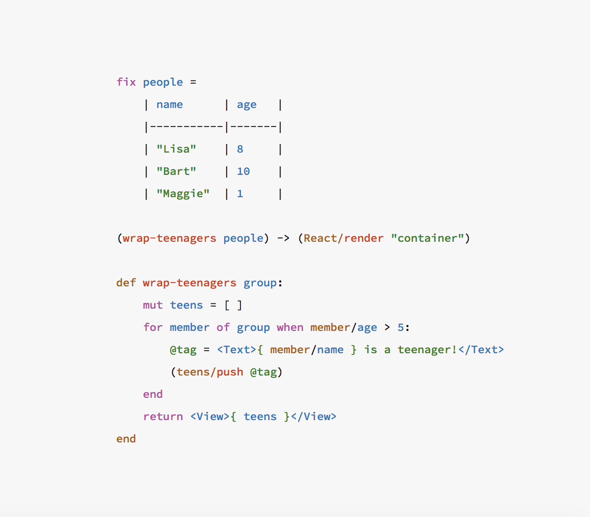

# Kary's Coding Umbrella

Kary's Coding Umbrella is an ecosystem of many different families of projects, designed to enhance programming beauty. Kary Coding Standards are part of this bigger project and therefore it is nice to know the rest of the umbrella

## Orchestra Language

Orchestra itself is a big umbrella of projects. Orchestra Language is the core of Orchestra family. It is a modern, visual language that compiles into Regular Expression. Orchestra language makes Regular Expressions much more readable and easier to write and therefore it reaches a point of possibility in scaling RegExes that was previously not even possible.  

## Kary Pro Colors

Pro Colors is a theme for coding. Pro Colors is designed to change the feeling of coding, mainly to make it feel like candy.

Pro Colors is built on a radical idea that combination of different tokens must have a coherent harmony. It has been designed so carefully to contain this harmonies. Pro Colors is also designed to statistically hold the percentage of color usage across different files based on the probability of combinations and their usage frequency. 

Another idea, core to the Pro Colors is that any token must be colored. Pro Colors has taken an extraordinary measure to make this possible by defining the color specific to 300+ individual tokens and also defining and contributing to many language definitions and grammars to support rich tokenization.

## KaryScript Language

KaryScript was an experimental project in order to find a language that is more readable and beautiful. Initial idea was to find a language that is more beautiful without any formatting and also is readable with fewer jumping.

## themeX

themeX is an attempt to accelerate the development of universal rich editor color schemes. It makes defining themes that have hundreds of tokens possible. it makes it possible to define different color sets for a theme and also makes it possible to export the theme to many different editors. themeX tries to push the state of beauty and possibility in modern themes 

