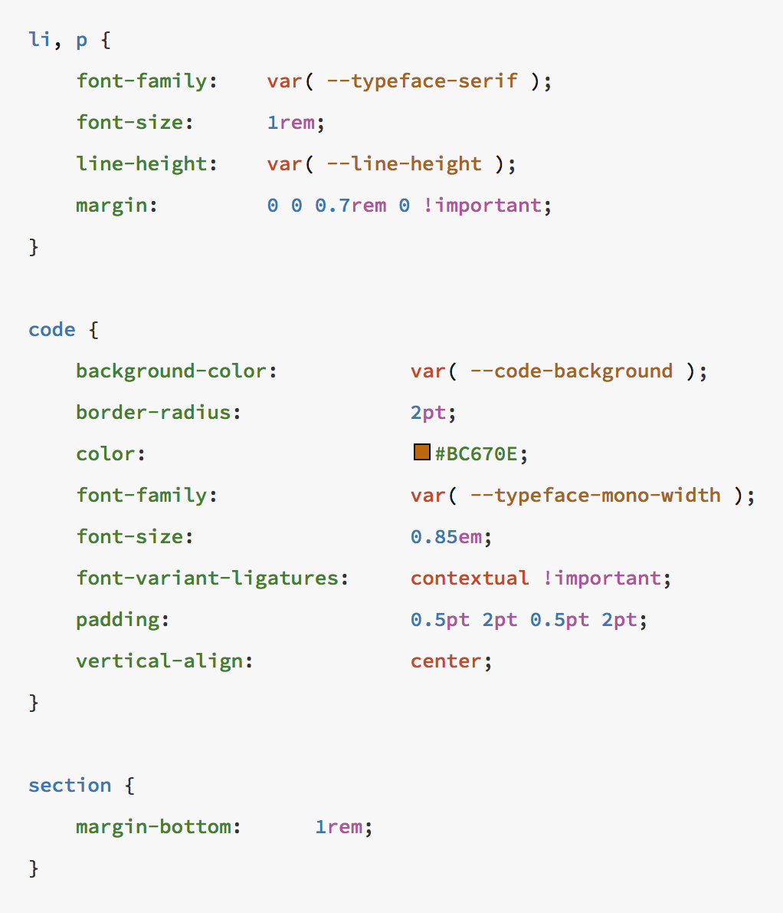
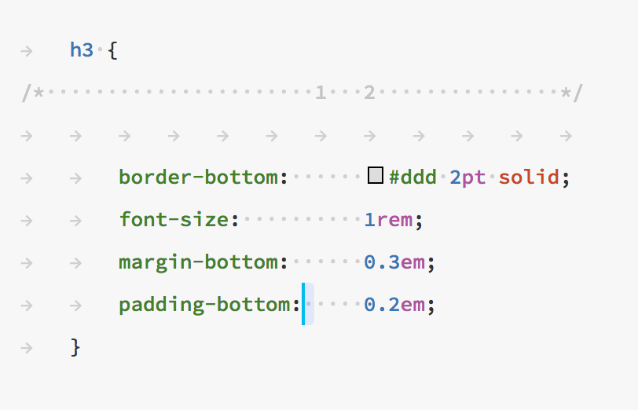
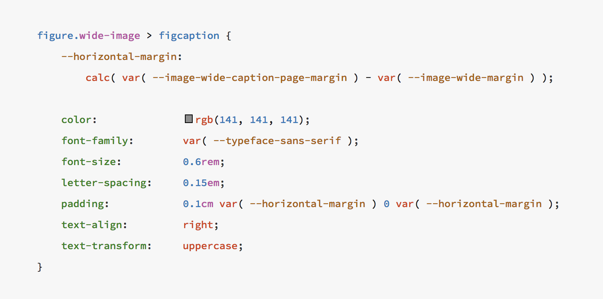
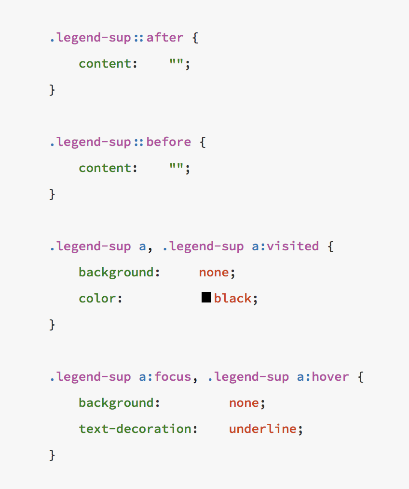
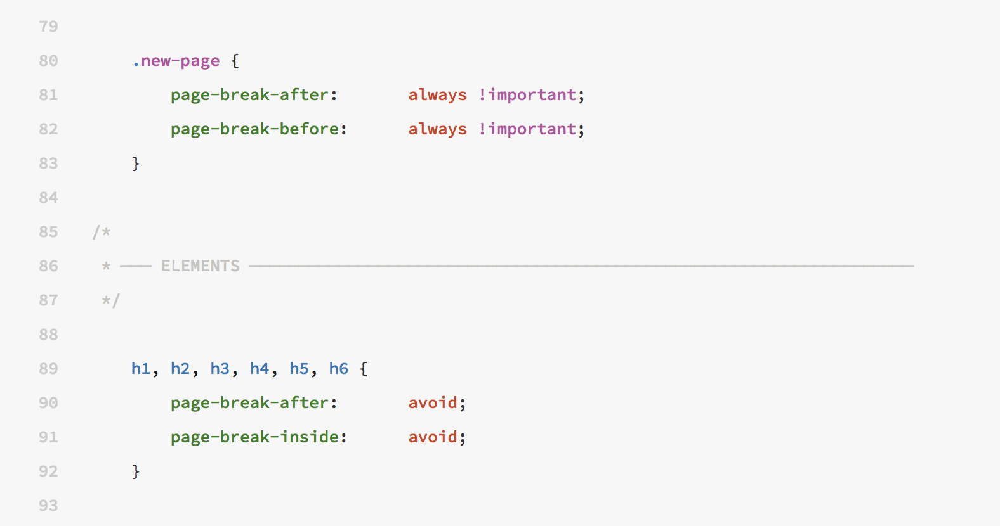

# CSS Family


[Righteous](../tools/righteous.md) is an experimental code formatter engine that implements the Kary Coding Standard for CSS language. You can simple utilize it within your editor of choice and have all the formatting done for you. 


### 

### The Rule Of Columns

CSS is basically a sheet of settings and it'll be so much more readable if settings look like settings. So putting rules into two columns and showing them as a table is the most convenient  way of showing these sheets.

Rule here is that that each column must begin at a tab and the space between the two must not be less than 2 characters.

To understand it better look at this example. Here as you can see the tabs and spaces are rendered with arrows and dots. Now if you look at the column of properties it has started at the tab that is aligned to the number 2, the reason is if it started at column 1 then the number of characters between the two columns would have been 1 char \(as the selection shows\)


You don't have to write this by hand and worry about it since it is automatically done by [Righteous](../tools/righteous.md). 


### Variables

CSS Variables are nice additions to CSS and to have them rendered beautifully we have a special rule about them. Since variables are no settings, they have to be separated from the settings and that's why they should be defined in the top of the rule and separated by one empty line to the settings

Also as you can see in the example, the way of writing variables is much different. They are written with their values in the next line and indented by one tab. In case of many variables, they have to be written below each other without any spacing

### Rule Spacing

Rules much be separated by one line as demonstrated in this figure:

### Kary Comments

When used, [Kary Comments](../kary-comments/introduction.md) must be applied with their respective one level of indentation. And the [Line Comments](../kary-comments/line-comments.md) must deindent this level of indentation.

