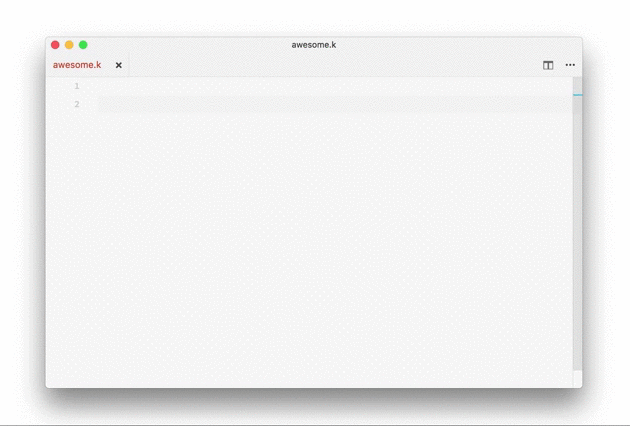
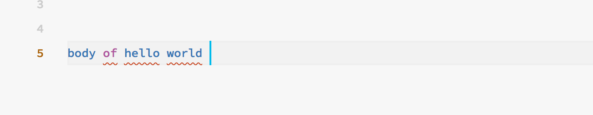
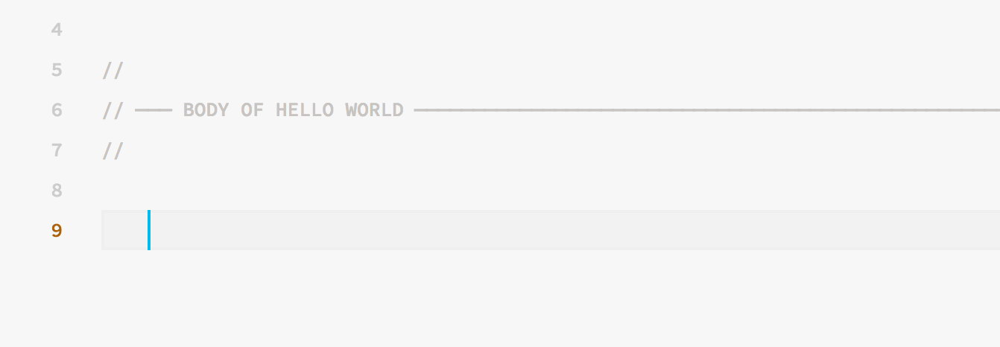
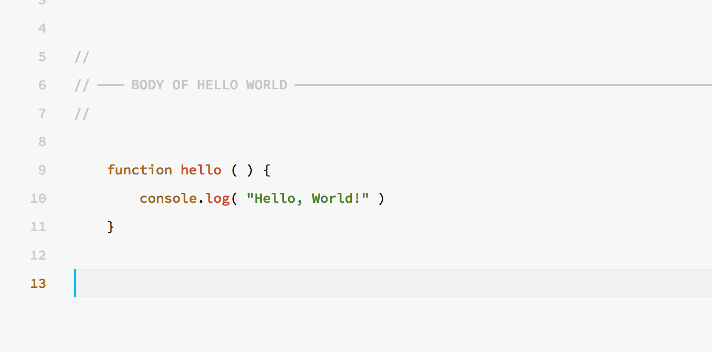

# Comment V for Visual Studio Code


You are reading a draft edition of this document. If you found any errors, please report them to [kary@gnu.org](mailto:kary@gnu.org)


Comment V is the most user-friendly implementation of Kary Comment Generators \(KCGs\). Unlike the previous versions \(III, IV\); Comment V is an editor extension and as a result it knows the environment of the code, it know the language, indentation settings, et cetera and therefore with push of a button it is able to write the desirable comment for you.



## How It Works?

1• Start a new empty line and write a title for your comment there



2 • Push `y` while holding `alt` and you see the line becoming a section comment:



3 • Notice the extra lines and the indentation. Comment V creates enough space for you to reach where you should write your code. So; write your code.



## Available Commands

| Comments | Keybindings | Additional Information |
| :--- | :--- | :--- |
| Flag | `alt` + `shift`+ `y` | You'll have to also give it the index number |
| Section Header | `alt` + `y` | Section Comment for Indentation less than 2 and InSection comment for the rest |
| Reverse Section Start | `alt` + `m` | _same as section comment_ |
| Section End | `alt` + `l` | Line Comment for Indentation less than 2 and Separator comment for the rest |

## Supported Comments

```text
──
── ─── INDENTATION LEVEL 1 ────────────────────────────────────────────────────────
──

──
── ─────────────────────────────────────────────────── REVERSE SECTION HEADER ─────
──

        ──
        ── ─── INDENTATION LEVEL 2 ─────────────────────────────────────────
        ──

        ──
        ── ──────────────────────────────────── REVERSE LEVEL 2 HEADER ─────
        ──

                ──
                ── INDENTATION LEVEL 3
                ──

                ── • • • • •

        ── ─────────────────────────────────────────────────────────────────

── ────────────────────────────────────────────────────────────────────────────────
```


