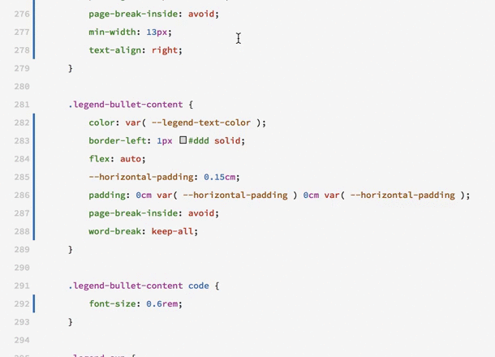

# Righteous — CSS Formatter


You are reading a draft edition of this document. If you found any errors, please report them to [kary@gnu.org](mailto:kary@gnu.org)



Righteous is a formatter for CSS that implements Kary Coding Standards. It is written as a reconstructing formatter which means righteous parses the code into an AST \(abstract syntax tree\) and then rewrites that tree into CSS. This technique ensures everything is based on the standard and therefore leaves nothing to be done by the user.

## Righteous for Visual Studio Code

Currently—and till reaching a stable release—Righteous is only available as a _Preview_ Visual Studio Code extension. Righteous is being used in many production/experimental projects to be diagnosed with care. You may start using it but you must be careful about it.



## Righteous Core for Developers

Righteous is a JavaScript package designed to be runnable anywhere. It gives the simplest API possible to make the task of its integration the easiest. It can be easily used within any [Electron](https://electronjs.org) based editor.

The **npm** package for Righteous can be found at

And be very simply used as

```javascript

//
// ─── IMPORTS ────────────────────────────────────────────────────────────────────
//

    const righteous = require('righteous-core')

//
// ─── BODY ───────────────────────────────────────────────────────────────────────
//

    const code = "h1 { color: red }"

    try {
        // Righteous is a simple function, you feed
        // it source code and it returns the formated 
        // one
        const formattedCode = righteous( code )
        
    } catch ( e ) {
        // also keep in mind that on parse failiure
        // or unsupported tokens, it'll throw you errors
        // so always have the try/catch
        throw e
    }
    
// ────────────────────────────────────────────────────────────────────────────────

```

